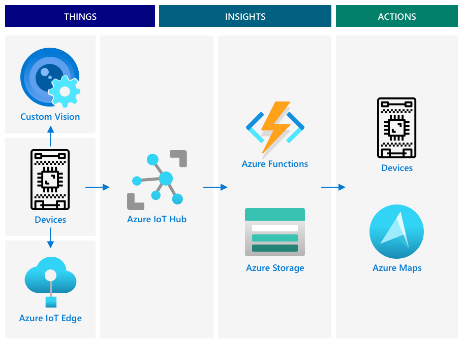
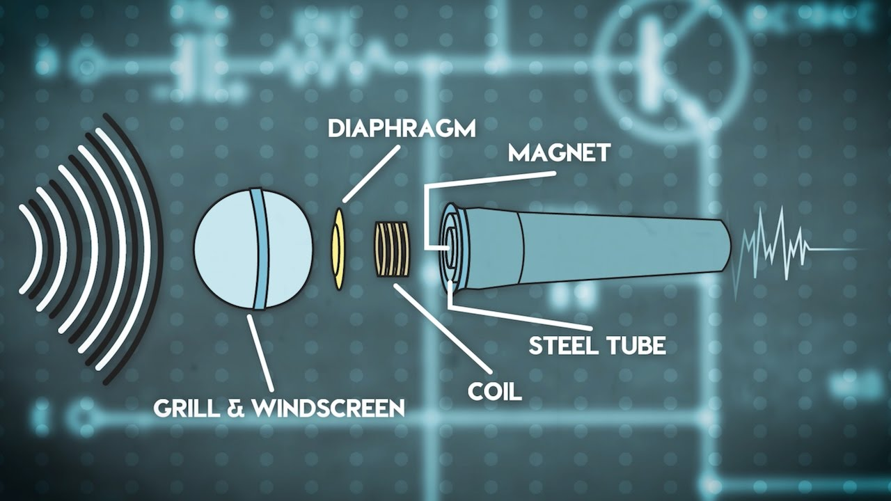

SDKs: software development kits
API: application programming interfaces
QoS: Quality of Serive
MQTT: Message Queueing Telemetry Transport
AMQP: Advanced Message Queuing Protocol
HTTP(S): HyperText Transfer Protocol (Secure)
GUI: Graphical user interface
RTOS: Real-time operating system
GPIO: General-purpose input/output
PWM: Pulse-Width Modulation
ADC: Analog-to-Digital
DAC: Digital-to-Analog
MCU: Microcontrollers unit
LED: Light Emitting Diode
BLE: Bluetooth Low Energy
Broker: a communication protocol
Telemetry: Data gathered from sensors and sent to the cloud
Eclipse Mosquitto: an open-source MQTT broker
Commands: messages sent by the cloud to a device, instructing to do something
Serverless (computing): small block of code run in the cloud, only response to different kinds of events, especially when it happen. You don't pay server service, instead you pay for the time your code is running, and the amount of memory used.
FaaS: Functions as a Service
COBOL: COmmon Business-Oriented Language
Functions app: the shell of serverless code
IoT Hub trigger: connect to the stream of messages that are sent to the IoT Hub and respond to them. Connect to the IoT Hubs event hub compatible endpoint.
Event Hubs: service allows you to send and receive messages
Secret key: for IoT device connect to an IoT Hub
iothubowner Permission: gives any code full permission to IoT Hub
Registry Manager: tool allows see what devices are registered with the IoT Hub
DDoS: Distributed Denial of Service, a cyberattack with multiple systems flood a target (server, web or network)
TCP/IP: Transmission Control Protocol/Internet Protocol
Encryption key: value used to encrypt the data
Decrytion key: value used to convert the data back to a readable format
Cryptography: technique of en-decrypt
Caesar cipher: shifting the alphabet by a defined amount
Vigenère cipher: shifting text by a different amount
Symmetric encryption: same key to en/decrypt data
Asymmetric encryption: 2 keys, encryption/public key and decryption/private key
Public key: encrypt message only, anyone can have
Private key: decrypt message only, kept private by recipient and never shared
Connection string: connected string contains information about IoT Hub (HostName), device (DeviceId), secret key (SharedAccessKey). A devices have 2 connection strings, as well as 2 SharedAccessKey. It allows you to rotate the keys - switch from one key to another if the first gets compromised, and re-generate the first key.
HostName: URL of the IoTHub
DeviceId: unique ID of the device
SharedAccessKey: a symmetric key known by device and IoT Hub, used to encrypt data that is sent or received. never be sent from the device to the cloud, or cloud to device. It is better to load it from a hardware security module than writing in your code.
Hardware Security Module: a chip on IoT device that stores encrypted values that can be read by your code.
SAS: shared access signature token consist HostName, timestamp and signature
Timestamp: time that SAS expired, usually 1 day from current time
Signature: contains HostName and Timestamp encrypted with the SharedAccessKey from Connection string. IoT Hub decrypts this signature with SharedAccessKey and check if HostName and Timestamp correct and still valid (before the expiry).
NTP: Network Time Protocol server, usually used to provide current time.
X.509 certificates: (1) digital documents that contain the public key part of the public/private key pair and has been verified by one of a number of trusted organizations called Certification authorities (CAs). (2) it includes the owner of key, details of CA who issued it, how long it is valid for, and the key itself. (3) Can be shared between devices
GPS: Global Positioning Sysem
Connected vehicles: are connected to central IT systems reporting information on their location, other sensor data.
Logistics: transporting goods from one place to another
Geospatial coordinates: a pair of coordinates used to define points on the Earth's surplace
Latitude: parallelly horizontal line, equator: 0°, North Pole: 90°, South Pole: -90°.
Longtitude: parallelly vertical line go from -180° to the west of the Prime Meridian (antimeridian), to 0°, to 180° east of it (also antimeridian). Longtitude is imaginary straight line that go from North Pole to the South Pole, through British Royal Observatory in Greenwich, England; forming a semicircle in 1884.
DMS: 60-based degrees°-minutes'-seconds''. To convert to decimal, using D + M/60 + S/3600
GPS sensors: catch GPS radio waves through antennas, which is built into trucks and cars with on-board GPS. Send GPS data over UART
Satellites signal: are sent over radio waves and detected by GPS sensor's antenna. Distance = (Embeded timestamp - Current measure time) * Radio_waves_speed. GPS sensor needs at least 3 info from 3 satellites to pinpoint a location on Earth.
Satellites atomic clocks error: drift by +38 microseconds(µs)/day. This is due to +45 μs (weaker gravity) − 7 μs (faster speed) = +38 μs/day. As satellites move faster than Earth rotation speed (14,000 km/h > 1,670 km/h), and experience ~20,000 km above Earth - weaker gravity. This error can cause 1µs~300m error = 12km error/day, so it is handled fore-hand.
UART: Universal asynchronous receiver-transmitter. Each devices has transmit (Tx) and receive (Rx) pins, with Tx of 1st device connect to Rx of the 2nd.
NMEA: National Marine Electronics Association, a US-based trade organization that sets standard for communication between marine electronics.
NMEA GPS data:
    - start with a %
    - has 2 letters talker ID (e.g. GP = GPS, GN = GLONASS)
    - has 3 letter message type (e.g. GGA, ZDA)
    - contains comma-separate field
    - end with a checksum (*)
    `$GNGGA,020604.001,4738.538654,N,12208.341758,W,1,3,,164.7,M,-17.1,M,,*67`
    GN = GNSS (GPS + GLONASS)
    GGA = fix data
    020604.001 = Time 02:06:04 UTC
    4738.538654,N = Latitude 47°38.538654' North → 47 + (38.538654 / 60) = + 47.6423109 (N)
    12208.341758,W =  Longtitude 122°08.341758' West → 122 + (8.341758 / 60) = -122.1390293 (W)
    1 = GPS fix status: 1 = valid fix
    3 = number of satellites used
    164.7,M = Altitude 164.7 meters above sea level
    -17.1,M = Geoidal separation
    *67 = Check sum for error checking
`ddmm.mmmm`
* dd = degrees
* mm.mmmm = minutes
GGA: GPS fix data (latitude, longitude, altitude, satellites)
ZDA: Date and time, timezone
GSV: Satellites in view (signal details)
N/S, E/W: North/South, East/West (positive/negative signs)
Degrees + (minutes / 60): decimal convert from lat/lon (added negative if W/S)
Structured data: data with well-defined, rigid structure that doesn't change and maps to tables of data with relationships. E.g. personal details
Unstructured data: data without well-defined, rigid structure that can change its *structure* frequently. E.g. written documents, spreadsheets, IoT data
Semi-structured data: structured but doesn't fit into fixed tables of data. E.g. JSON
RDBMS: Relational Database Management Systems, or relational database, is the first databases
SQL databases: it is called since Structured Query Language (SQL) is used to add, remove, update, query data
Schema: a well-defined set of tables of data, each table has multiple named columns. If you want to insert data, it will create a new row, and  you have to  put values into each of the columns - although you can also leave the columns empty.
NoSQL database: no pre-defined schema that limits how data is stored, can insert any unstructed data. Organized into folder or fields E.g. JSON document, Azure CosmosDB, MongoDB, CouchDB, table storage
Hot path: data needed to be processed in real time or near real time. E.g. alerts
Warm path: data can be processed a short while after received. Some cloud application run regularly each day to move data from warm-path storage into cold-path storage, a.k.a data warehouse. E.g. short-term analytics
Cold path: historic data, long-term data processed whenever needed. Stored in data warehouses. E.g. anual mileage reports, fuel cost reduction analytics route
Azure Storage Accounts: general-purpose storage service, store data in a variety of different ways.
Blob storage: Binary Large Objects. It can store any unstructed data from img, videos, documents, or json, csv, etc. Each blob has: name, path, metadata, access URL (if public/shared)
Containers: each blob must be stored inside a container, inside you can have folders. Folders can contain: blob (file), more folders (nested)
Table storage: store semi-structured data. It actually a NoSQL databse, so it is designed to store data in one or more tables, with unique keys to define each row.
Queue storage: allows store messages up to 64KB in size in a queue. FIFO sent & read like a queue. Long-term, store indefinitely as long as there is still storage. E.g. montly GPS data 
File storage: files in cloud, and any apps or devices can connect using industry standard protocols i.e. mount it as a drive on your PC and Mac. E.g. Azure File Storage, Google Drive, OneDrive, etc.

Connect your serverless code to storage
Your function app now needs to connect to blob storage to store the messages from the IoT Hub. There's 2 ways to do this:
* Inside the function code, connect to blob storage using the blob storage Python SDK and write the data as blobs
* Use an output function binding to bind the return value of the function to blob storage and have the blob saved automatically

Data visualization: visualizing data in ways that make it easier for humans to understand, and help them make decisions.
Map service: Azure Maps, Bing Maps, Leaflet, Open Street Maps, Google Maps, OpenBox Maps, etc.
Azure Maps: a collection of geospatial services and SDKs that use fresh mapping data to provide geographic context to web and mobile applications.
REST API: access Azure Maps APIs by leveraging its REST API, Web SDK
Web SDK: Software development kits for website, is a toolkit of code libraries, APIs, and utilities that helps developers build web applications or integrate specific features into them
--sku S1: paid tier, can access by verified Azure Student, else `S0` for free
PrimaryKey: API key for the maps resource
`div`: a section of a webpage that can be named and styled
GeoJSON format: an open standard JSON specification with special formatting designed to handle geographic `lon,lat` data. 
```json
{
  "type": "FeatureCollection",
  "features": [
    {
      "type": "Feature",
      "geometry": {
        "type": "Point",
        "coordinates": [
          -2.10237979888916,
          57.164918677004714
        ]
      }
    }
  ]
}
```
`Feature`:[`Feature`]: where data is nested
Geometry: can have different types from single point to a polygon
CORS: Cross-Origin Resource Sharing, usually needs to be set explicitly in Azure for security reasons. It stops sites you don't expect from being able to access your data.
`--account-name <storage_name>`: name of your storage account
`--account-key <key1>`: account key for your storage account
`--service b`: only apply this setting for blobs
`--origins "*"`: allows any website (the wildcard `*` means any)
`authOPtions{subcriptionKey}`: API key for your Azure Maps account
`restype=container`: indicate that resource type is a container
`comp=list`: list informations about all the blobs, return a URL for each blob that can be used to load the blob data
loadJSON(blobUrl.innerHTML): loads each blob
`ready` event: creates an Azure Maps data source
Azure Maps data source: a container contains GeoJSON data
Bubble layer: a set of circles on the map centered over each point the GeoJSON
Geofence: a virtual perimeter for a real-world geographic region. E.g. cicrles or polygons.
`type: FeatureCollection\type: Feature\type: Polygon`: defined polygon Geofence
Polygon geofence: contains polygon coordinates, which always has 1 more entry than the number of points on the polygon, with the last entry being same as the first, to close the polygon.
Curl: a command line tool to make requests against web endpoints, especially calling the Azure Maps web API
`properties` element: it is at the same level as the `geometry` element, and it has to contain a `geometryId`, which **MUST** be included and unique. Geofences can gave the same `geometryId` if they are uploaded from a diffrent file at a different time.
`subscription-key=<subscription_key>`: API key for your Azure Maps account
`https://atlas.microsoft.com/mapData/upload`: API used to upload map data
`api-version-1.0`: usual Azure Maps API version
`--request POST`: POST request, which is a type of HTTP method used to send data to a server to create something new
`--request GET`: Retrieve (fetch) data
`--request PUT`: Up/date/replace something
`--request DELETE`: Remove something
`--data @geofence.json`: to return a list of response headers which includeds a header called `location`
location: https://us.atlas.microsoft.com/mapData/operations/1560ced6-3a80-46f2-84b2-5b1531820eab?api-version=1.0
> 🎓 When calling a web endpoint, you can pass parameters to the call by adding a `?` followed by key value pairs as `key=value`, separating the key value pairs by a `&`.
curl --request GET '<location>&subscription-key=<subscription_key>': to check the value of `status` after previous upload request has finished
`status`: if it is not `Succeeded`, then wait a minute and try again
UDID: unique ID, which is contained in the `resourceLocation`. It is the value after `metadata/`, and not including the `api-version`.
```json
    {
      "resourceLocation": "https://us.atlas.microsoft.com/mapData/metadata/7c3776eb-da87-4c52-ae83-caadf980323a?api-version=1.0"
    }
```
UDID is `7c3776eb-da87-4c52-ae83-caadf980323a`.
`searchBuffer`: how accurate to be when returning results, default 50m, range from 0m to 500m.

✅ What additional data would you need to check to see if a GPS reading could be considered correct?
* Previous GPS readings (history), Timestamp, Speed
* Number of satellites: Less than 4 satellites = low confidence. More = more reliable fix.
* Cross-check if a road even exists to justify the position. No road = high chance it's false. Or if the jump changes heading suddenly and doesn’t match the route, it’s likely inaccurate (**Heading or direction**).

Consumer groups: multiple separate connections to read off events, each one can manage the replay of unread messages. There are up to 5 applications / consumer group to avoid duplicate
`--hub name`: your IoT hub name, $Default

Transfer learning: where you transfer the learning from an existing ML model to a new model based off new data.
Training models takes a lot of computer power, usually via Graphics Processing Units, or GPUs.
Custom Vision.ai: cloud based tool for training image classifiers. It allows you to train a classifier using only a small number of imgs (5 imgs/classification, 2 imgs to test, both smaller than 6MB). Once you completed training a model (Quick Training), you can publish versions of it that can be accessed through a web API or an SDK.
* Export can be standard model or compact model. Compact models use various techniques to reduce the size of model, making it small enough to be downloaded and deployed on IoT devices.
Domain of project: e.g. Food, Animal, etc. all domains can be change, by using your train data to train a new model with the new domain. All domains supported by Custom Vision are available as standard or compact.
Cognitive Services: is a range of AI Tools from Microsoft contains Custom Vision
`--sku F0`: is also the free tier, use `S0` sku if you already have a free account using any of the Cognitive Services

Camera sensor: digital sensor, work with jpeg, png, heic, etc.
Photodiode: recored as a pixel
Lens: focus image onto image sensor, and thousands or millions photodiodes detect light falling on each one, record that as a pixel data.
Lens: invert images, camera sensor flips image back the right way round
APS: Active-Pixel Sensor, which is an image sensor
CMOS: Complementary metal-oxide semiconductor sensor, the most popular type of APS
SPI: Serial Peripheral Interface, a communication protocol used to transfer data between microcontrollers and peripheral devices (like sensors, displays, memory chips, etc.)

✅ What are the limitations around image size with IoT devices? Think about the constraints especially on microcontroller hardware.
* Limited RAM: e.g. 64 KB to 512 KB. Small img 320×240 RGB = 225KB exceed that | Use small image resolution: 160x120, gray scale, or monochrome (1-bit) or compress early (JPEG)
* Limited Flash storage: 1-4 MB for code, libraries and assets | Solution: Add SD cards or external RAM/flash
* Low bandwidth: WiFi, BLE or LoRa, limited. Take seconds or too large to transmit
* Power consumption: Cap-store-send drain battery quickly | Solution: Increase your battery size
* Processing Power: slow CPU and no GPU, img processing (compress, resize, detect) is too heavy | Solution: send it to cloud for processing
* Network protocol limit: MQTT, HTTP, or CoAP may impose message size limits or chunking requirement. Some network (NB-IoT) can only send a few KB | Solution: Sending chunk of img instead a whole

Iteration: every time you train the model, you get a new iteration to keep track of the different versions of your model trained on different datasets.
Publish iteration: Performance/Choose latest iteration/Publish/Set Prediction resource
`Prediction-Key`: secure key passed when call the model

✅ When a new iteration is published, it will have a different name. How do you think you would change the iteration an IoT device is using?
* Sending a command of MQTT to switch model
* Update device twin field, which check a field called `desired.iteration`

✅ What else might cause the images captured by your IoT device to have incorrect predictions? Think about the environment an IoT device might be used in, what factors can affect the image being captured?
* Camera Angle / Placement | Solution: careful camera mounting
* Object size / Distance
* Lighting condition
* Motion blur
* Color distortion | Solution: Lens cleaning, On-device pre-filtering
* Obstruction
* Background Clutter | Solution: thresholding
* Compression / Resolution loss
* Weather: rain, snow, sunlight glare
* Unseen conditions: new surroundings or objects never been trained | Solution: augmented training data

Retrain using captured Image from IoT device: which can use the images on the `Predictions tab`.

Edge computing: moving some of the cloud services off the cloud & onto computers running on the same network as the IoT devices. E.g. run AI models on edge devices

✅ Think about the IoT applications you have built so far. Which parts of them could be moved to the edge.
* Sensor data filtering / Preprocessing
* Anomaly detection or Rule-Based logic
* ML inference (Tiny ML or Edge AI): result, cloud only gets high level info like "dog detected" instead of full image
* Data buffering & Aggregationn: send batch data to cloud periodically, lower bandwidth == smoother cloud-side analytic
* Device health monitor: battery, connectivity, internal errors

🚫 What Should Stay in the Cloud?
* Data storage
* Large model training
* Dashboard visualization
* Cross-device coordination

Edge device: you have to build and manage yourself, rather than relying on the expertise and scale of cloud services. However, some of the risk are mitigated by very nature of edge computing e.g. factory shut down, edge shut down -> don't need to recovery or backup as the machines that generate the data is shut down also

Azure IoT Edge: service that can help you move workloads out of the cloud to the edge i.e from the cloud, you can deploy code to a set up edge device
Workloads: any service that does some kind of work, e.g. AI models, applications, serverless functions
Modules: (functionally) software that is deployed to IoT Edge e.g. by default `edgeAgent` and `edgeHub`.When you deply an Image classifier, this is deployed as an additonal module.
Containers: (technically) self contained software that are run in isolation from the rest of the applications on your computer. It likes a separate computer running inside your computer, with its own software, services and applications running. Containers cannot access anything on your computer unless you choose to share things like a folder with the container. (2) Container expose services via an open port that you can connect to or expose to your network (e.g. port 80, default HTTP port that a website running on). (3) It is given a tag that defines a name and version for them. When you need to update a container you can build it with the same tag but with a newer version.
So, the modules and containers are one, depends on which concept you are related to. Modules are Azure IoT Edge's concept - a deployable unit of logic or service, while containers are the actual runtime technology (like Docker). You can use Custom Vision to deploy Image Classifiers as containers, then it can be accessed using the same REST API as the cloud version, but with the endpoint pointing to the Edge device running the container
Container Registry: an online location where you can store containers. IoT device can download container from registry and push it to your device.

✅ Do some research: Read up on containers and services such as Docker or Moby.
* Docker: one of the most popular container platform that helps you: (1) Create (build) containers, (2) Run containers, (3) Share containers (via Docker Hub), (4) Manage container lifecycle
* DockerFile: a set of instructions on how to set up the container
> Once you have downloaded and exported from Custom Vision: (1) DockerFile containing instructions on how container should be built, (2) Application code that will be run inside the container to host your custom vision model, (3) REST API to call it; you can use **Docker** to build a tagged container from ***DockerFile***, then push it to your container registry.

* Moby: open-source project that Docker is built on. It’s the core building blocks of Docker (the engine, CLI, etc.). Developers and organizations can use Moby to create custom container systems. Used in IoT Edge (e.g., Azure IoT Edge uses Moby to run containers on edge devices) 🔹 Docker = user-friendly product built using Moby's components.

SSH: Secure Shell, which is protocol used to securely connect to remote computers, especially Linux-based systems, over a network (like the internet or a local network).

Reference IoT architecture: an example you can use as a reference when designing new systems. If you were building a new IoT system, you can follow the reference architecture, substituting your own devices and services where approriate.

**MUST REMEMBERED**
****

* Things: devices that gather data from sensors, maybe interacting with edge services to interpret that data. Device's data is sent to IoT service
* Insights: serverless applications, or from analytics run on stored data
* Actions: commands sent to devices, or visualization of data allowing humans to make decisions
* Things - you've written device code to capture data from sensors, and analyse images using Custom Vision running both in the cloud and on an edge device. This data was sent to IoT Hub.
* Insights - you've used Azure Functions to respond to messages sent to an IoT Hub, and stored data for later analysis in Azure Storage.
* Actions - you've controlled actuators based on decisions made in the cloud and commands sent to the devices, and you've visualized data using Azure Maps.

✅ Think about other IoT devices you have used, such as smart home appliances. What are the things, insights and actions involved in that device and it's software?

✅ Think about the data security of any IoT devices you own. How much of that data is personal and should be kept private, both in transit or when stored? What data should not be stored?

✅ One of the trends with the rise of IoT (and technology in general) is that manual jobs are being replaced by machines. Do some research: How many jobs are estimated to be lost to IoT? How many new jobs will be created building IoT devices?

Trigger IoT device: e.g. measure when the fruit is at the right location on the conveyor belt by measuring the distance to a sensor
Proximity sensors: measure the distance from the sensor to an object. Usually transmit a beam of electromagnetic radiation such as laser beam or infra-red light, then detect the radiation bouncing off an object. The time between the laser beam being sent and the signal bouncing back can be used to calculate the distance to the sensor

Flow of IoT device using trigger:
* A proximity sensor measuring the distance to a piece of fruit and sending this to IoT Hub
* The command to control the camera coming from IoT Hub to the camera device
* The results of the image classification being sent to IoT Hub
* The command to control an LED to alert when the fruit is unripe being sent from IoT Hub to the device with the LED

Object detection: Highlitght the section of an image that contains the specific object, and tag that. Return a list of bounding box and their percentage that the object matches the assigned tag.
YOLO: You only look once, incredibly fast that detect 20 different class of objects, such as people, dogs, bottles and cars
Train object detector: at least 15 images containing each object to detect from a variety of different angles and in different lighting conditions (< 6 MB)
Suggested tags feature: use the trained model to detect the objects in the untagged image.

Stock counting: or can even detect unexpected items, to alert human or robot to return the item as soon as possible
Bounding box: top, left, height, width. top is 0.0, which is at the top-left of the image. bottom = top + height. (0-1)

✅ Can you think of a situation where is it valid to detect one object inside another?
* Person inside a room or building
* Vehicle inside a parking spot or zone
* Item inside a container or box
* Object inside a Geofence
* Face inside a Mask area or Helmet
* Food inside a Plate or Container
* Intruder inside a Restricted area

Microphones: analog sensor that convert sound waves into electrical signals. vibrations in air cause components in microphone to move tiny amounts, and these cause tiny changes in electrical signals. These changes are then amplified to generate an electrical output.

Dynamic microphones: have magnet attached to a moving diaphragm that moves in a coil of wire creating an electrical current.



Ribbon microphones: have metal ribbon instead of a diaphragm.

Condenser microphones: have a thin metal diaphragm and a fixed metal backplate.