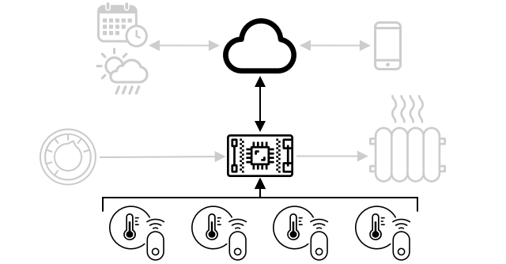

# Connect to internet

## Internet
- Cloud connectivity & services enable:
    * gathering measurements from the connected sensors 
    * sending messages to control actuators
- IoT devices ypically connect to a **single cloud IoT service** using a **standard protocol**
- That service connect to the rest of your IoT application

> Data gathered from sensors and sent to the cloud is called telemetry.

- IoT devices receive messages from the cloud (commands i.e instruction)
- This lesson introduces:
    + communication protocols IoT devices
    + data type they send or receive

## Communication protocols
- Publish/subsribe message via broker
- IoT devices                                       Cloud services
    * publish telemetry        --- Broker ---  * subcribe to all telemetry messages 
    * subscribe to commands                    * publish commands (group) devices

- MQTT: most popular protocol for IoT devices
- Others: AMQP, HTTP/HTTPS

### Message Queueing Telemetry Transport (MQTT)
- Light weight, open standard messaging protocol that can send messages between devices
- Designed in 1999 to monitor oil pipelines, before being released 15 years later by IBM

#### Structure:
- Has single broker & multiple clients
                            (MQTT)
- All clients --->[connect] broker [messages] ---> relevant clients
- A client [publish]---> Messages[topics] <<----> [received] subcribed clients

#### Messages:
- A hierachy of topics <----[wildcards] subcribed clients
- [Device A] -----> `/telemetry/temperature`
  [Device B] -----> `/telemetry/humidity`
  `/telemetry/*` <<---->`/temperature & /humidity` [☁️Cloud App]

#### Quality of serive (QoS)
- Messages can be sent with a QoS to determine the guarantee of received message
    * At most once: Sent once, no acknowledgment (fire and forget).
    * At least once: Retries until acknowledged (may duplicate).
    * Exactly once: Ensures one delivery via handshake (no duplicates).

- If a client disconnects, then reconnects won't help it receive messages sent during disconnection, except for those messages had already started to process using QoS.
- Or, they can have a retained flag set on them, which the MQTT broker will store, then send to any clients subsrcribe to the topic.

#### Features:
- MQTT also supports keep alive function: check if connectionis still alive during long gaps between messages.

> 🦟 [Mosquitto from the Eclipse Foundation](https://mosquitto.org) free MQTT broker, along with a public MQTT broker you can use to test your code [test.mosquitto.org](https://test.mosquitto.org).

- MQTT can be public && open/encrypted && secured using [usernames][passwords] or [certificates]

- It communicates over TCP/IP, same underlying network protocol as HTTP, but on a different port.
- Can also use over websockets to:
    * communicate with web apps in browser
    * in situations where firewalls or other networking rules block standard MQTT connections.

### Telemetry
- I.e. measure remotely (Greek)
- Gathering data from sensor && send to the cloud
- Example of the earliest:
    * France, 1874
    * Real-time weather && snow depths [Mont Blanc]---->[Paris]
    * Physical wires (wireless not avaible)

- Example:

* Thermostat uses a built-in sensor:
    - measure the local temperature
    - connect to extra sensors in other rooms to make smarter heating or cooling decisions wirelessly (e.g. [Bluetooth Low Energy] or BLE).

* Cloud service use this data to make command sent to control the heating

#### Receive telemetry from MQTT broker
- `Server code` consists a Python app that listens to telemetry messages over MQTT with light levels.

#### How often should telemetry be sent?
- It depends:
    * Thermostat: every few minutes
    * Machinery: may be multiple times a second
> You should consider having an edge device to process the telemetry first to reduce reliance on the Internet.

### Loss of connection
- Store sent data, or lose it? It also depends:
    * Thermostat: can be lost as soon as a new temperature measurement has been taken. However, some smart thermostat can make some limited decision to control heating if it can't send telemetry to the cloud due to an outtage.
    * Machinery: keep data, to look for trend
> For MQTT to handle a loss of connectivity, device and server code need to ensuring message delivery i.e sent messages must be replied by an additional topic, or they are queued manually to be replayed later

## Commands