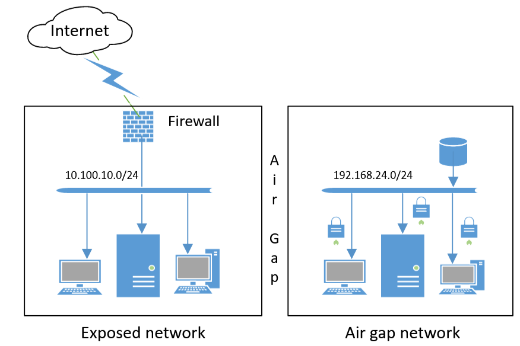
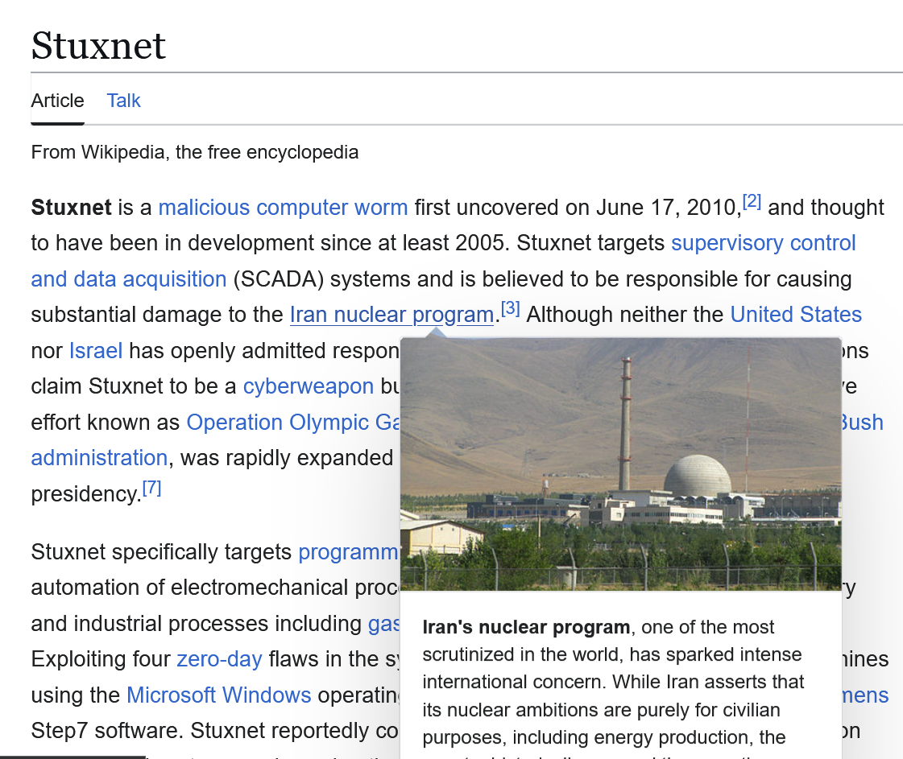

# A deeper dive into IoT

## Components of IoT application
- *Internet* and *thing*

    ### The Thing
    - Device that can interact with physical world
    - Small, low-priced computers, running at low speeds and using low power
    - Interact with the physical world:
        * Use sensor to gather data from their surroundings
        * Controlling outputs or actuators to make physical changes
    - E.g: smart thermostat has
        (1) temperature sensor 
        (2) dial or touchscreen: means to set a desired temperature
        (2) connection to a heating or cooling system, which is turned on when the temperature detected is outside the range.

    ### The Internet
    - Consists of application IoT device can connect to send & receive data
    - Other applications that process data from IoT device and help make decision on what requests to send the actuators

    - Typical setup:
        IoT device
            ⇵
        Cloud service
        (Security, Receiving messages, Sending message back)
            ⇵
        Applications
        (Process or store sensor data, Use sensor data with data from other systems to make decisions) 
    
    - Doesn't always connect directly to Internet via WiFi or wired connections
    - Use mesh networking: Bluetooth
    - Connect via a hub device that has Internet connection

    - E.g: smart thermostat
        * connect using home WiFi to a cloud service running in the cloud
        * send temperature data -> cloud service -> written to a database
        * cloud service (know the desired temperature) -> send back to smart thermostat -> turn the heating system on or off

        Cloud + AI: use data from other sensors of other devices (occupancy sensors detect what rooms are in use, weather and calendar) to set the temperature.
    
    
    
    ### Edge Devices
    - Gateway devices run on your local network
    - Run oflline where Internet connectivity is not possible (e.g. ship, disaster area)
    - Keep data private
    - Processing and run code created using cloud tools locally
    - Gather and respond to data without using an Internet connection to make decision

    - E.g: Apple HomePod, Amazon Alexa, Google Home
        * listen to your voice using AI models trained in the cloud
        * run locally on the device
        * device only wake up when a certain word or phrase is spoken
        * then send your speech over Internet for processing
        * stop sending speech at an approriate point, e.g. pause in speech
    
    ### IoT Security
    - Devices connect to a cloud service ⇉ depends on cloud security.
    - Sometimes both IoT devices and edge devices run on a network completely isolated from the Internet, which is known as [air-gapping](https://wikipedia.org/wiki/Air_gap_(networking)). 
    - It ensure that a secure computer network is physically isolated from unsecured networks, such as the public Internet or an unsecured local area network. It means a computer or network has no network interface controllers connected to other networks.

    

    - E.g: 
        * [Stuxnet worm](https://wikipedia.org/wiki/Stuxnet) manipulated valves in centrifuges to damage them.
        
        * [Poor security to access baby monitors](https://www.npr.org/sections/thetwo-way/2018/06/05/617196788/s-c-mom-says-baby-monitor-was-hacked-experts-say-many-devices-are-vulnerable) and other home surveillance devices have been accessed by ackers.
        

## Microcontroller
### Input/Output
- Microcontrollers need input and output (I/O) connections to read data from sensors and send control signals to actuators.
- Usually contain number of general-purpose input/output (GPIO) pins.
- Pins can be configured in software to be input or output:
    * Input pins: read values from sensors
    * Output pins: send instructions to actuators

## Frameworks and operating system
- Microcontrollers don't run an operatin system (OS) in the desktop sense of the word (Windows, Linux or macOS).
- To program a microcontroller without an OS you do need some tooling to allow you to build your code in a way that the microcontroller can run.
- Each microcontroller is different, so manufacturers normally support standard frameworks which allow you to follow a standard 'recipe' to build your code & have it run on any micrcontroller that supports that framework.

- Can program using real-time operating system (RTOS), which are designed to handle sending data to and from peripherals in real time:
    * Multi-threading: allow code run mroe than one block of code at the same time (either multi cores or one core)
    * Networking: allow communicating over Internet securely
    * Graphical user interface (GUI): components for building UI on devices that have screens.

    ### Adruino
    - Coded in C or C++
    - 2 functions - `setup` and `loop`
    - When board starts up, Adruino framework code run the `setup` function once, then it will run the `loop` function again and again
    - Running it continousely until the power is powered off

    - `setup` function:
        * connecting to WiFi & cloud service
        * initializing pins for input and output
    - `loop` code: processing code
        * read from sensor
        * sending value to the cloud
        * include a `delay` in each `loop`
    
    

    ⇉ *event loop* or *message loop*. Many applications use this under the hood.
    - Standard for most desktop applications that run on OSes like Windows, macOS or Linux.
    - `loop` listen for messages from user interface like buttons, keyboard, etc. and respond to them.

    - Adruino provides standard libraries for interacting with microcontrollers and I/O pins, with different implementations under the hood to run on *different controller*.
    - E.g: `digitalRead` will read a value of `HIGH` or `LOW` from the given pin, regardless of which board the code is run on.
    ⇉ Adruino code for one board can be recompiled for any other Adruino board and will run, assumming that the pins are the same and the boards support the same features.