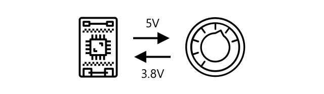
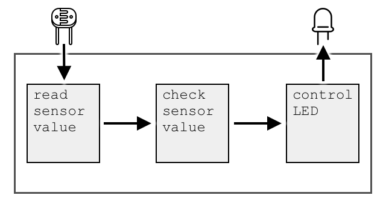
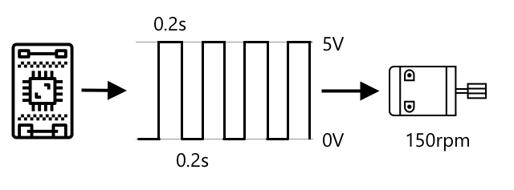
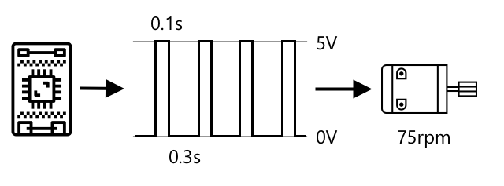

# Sensors and actuators

# Sensors
- Hardward devices can sense physical world
- Measure one or more properties around them
- Send to an IoT device

- Example:
    * Temperature sensors
    * Buttons
    * Light sensors
    * Cameras
    * Accelerometers
    * Microphone

- One thing in common, they convert whatever they sense into an **electrical signal** that can be interpreted by an IoT device.

## Sensor types
- Are either analog or digital

    ### Analog
    - Receive a voltage from IoT device
    - Sensor components adjust this voltage
    - Voltage that is returned from sensor is measured to give the sensor value
    - Sensor value is read by IoT device, and the device can respond to it
    - Depending on the sensor, this voltage can be an arbitrary value or can map to a standard unit.

    > How volatge is measured?
    It is measured: How much push there is to move electricity from one place to another. E.g. positive terminal of battery -> negative terminal of battery.
    * An LED can light between 2-3V, a standard battery is 1.5V.

    - Potentiometer: a dial that can be rotated between two positions. The sensor will measure the rotation
    
    - IoT device send e-signal -> potentiometer at a voltage (5V)
    - Potentiometer is adjusted it changes the voltage that comes out of the other side to 3.8V.
    - Imagine you have a potentiometer labelled as a dial that goes from 0 to 11.  When it is in the full on position (11), 5V (5 volts) will come out, otherwise.

    - Analog temperature sensor based on a thermistor: the output of voltage can be converted to a temperature in Kelvin, and correspondingly into °C or °F, by calculations in code.

    ### Digital conversion
    - IoT devices are digital, i.e they can't work with analog values.
    - They only work with 0s and 1s.
    > Analog sensor values --> converted to digital signal before they can be processed.

    - ADCs (analog-to-digital converters): convert analog inputs to digital representations of their value.
    - Sensor can work with ADCs via a **connector board**.
    - E.g: in the Seeed Grove ecosystem with a Raspberry Pi, you can't directly connect analog sensors to the Pi’s GPIO pins, because the Pi doesn't have a built-in ADC (Analog-to-Digital Converter).
    To solve this, you use a `Grove HAT` — a special expansion board that: 
      * analog sensors connect to specific ports on a `hat` that sits on Pi connected to Pi's GPIO pins.
      * this `hat` has an ADC to convert the voltage into a digital signal that can be sent off the Pi's GPIO pins.

      * If you have an analog light sensor (0V~3.3V) ⇄ IoT device
      In one scenario, the sensor outputs 1V. ADC will convert 1V into a digital number.
      Seeed Grove light sensor maps 0~3.3V to a 10-bit range (0–1023):
                1V/3.3V * 1023 ≈ 310
      For this sensor, 1V gets converted to the digital value around 300–310 (let’s say 300 for simplicity).
      * The number 300 is converted to `0000000100101100`(which is 16 bits with leading zeros). This binary data is what gets sent from the Grove HAT ⇉ Raspberry Pi over the GPIO pins.

      Light Level → GroveSensor → Voltage (e.g. 1V)
          → HAT ADC → Digital value (e.g. 310~300)
          → Binary (e.g. 0000000100110110)
          → Raspberry Pi → IoT app uses the value
        
      From there, you can:
        * Display it on a dashboard
        * Send it to the cloud
        * Use it to control another device (like turning on a lamp if it's too dark)
    
    ### Digital sensors
    - Like analog sensor, detect the world around them using changes in electrical voltage.
    - Output: digital signal, measuring two states or built-in ADC
    - Example: button or switch (on or off)

    

    - Pins on IoT device (e.g GPIO pins) can measure this signal directly as 0 or 1.
    - If voltage sent is same as volt returned -> read_value is 1
    - Else -> read_value 0

    > 💁 Voltages are never exact especially as the components in a sensor will have some resistance, so there is usually a tolerance/threshold.

    * 3.3V goes into the button. The button is off so 0V comes out, giving a value of 0
    * 3.3V goes into the button. The button is on so 3.3V comes out, giving a value of 1

    > GPIO pins on a Raspberry Pi work on 3.3V, and read a return signal > 1.8V as a 1, < 1.8V as 0.

    - **More advanced digital sensors**
        Read analog values --> on borad ADCs --> digital signals
    Example:
        Temperature → Thermocouple → Voltage (e.g. 2.1mV)
           → Built-in ADC → Digital value (e.g. 150)
           → Binary (e.g. 10010110)
           → Electrical Signal (1 = 5V (`HIGH`), 0 = 0V (`LOW`))
           → IoT Device Input Pin
           → IoT App interprets temperature as sequence then transfer to bits:
            `HIGH LOW LOW HIGH LOW HIGH HIGH LOW`
              |    |   |   |    |   |    |    |
              1    0   0   1    0   1    1    0   ← binary bits of 150

# Actuators
- Convert electrical signal from IoT device → interaction with physical world
- E.g: emitting light/sound, moving a motor

- Example:
    * LED
    * Speaker
    * Stepper motor
    * Relay
    * Screens

## Actuators flow
- Light Level → Grove Light Sensor → Voltage (e.g. 1V)
    → `Grove HAT ADC` → Digital value (e.g. ~300)
    → Binary (e.g. `0000000100101100`)
    → Raspberry Pi → IoT app receives value

    > → App logic: if light level < threshold (e.g. 400)
       → Turn `ON` LED (send digital HIGH to output pin)
    > → else
       → Turn `OFF` LED (send digital LOW to output pin)

    → Output pin → LED → Light `ON or OFF`

## Actuators types
- Analog or digital

    ### Analog actuators
    - IoT: analog signal ---> actuators ---> convert to interaction changes based off the voltage supplied.
    - E.g: dimmable light, amount of volt supplied determine how bright it is

    

    IoT device:
    - Send an analog signal ---> digital-to-analog (DAC) either on board or connector board
    I.e. convert 0s and 1s to an analog volt ---> actuator

    ### Pulse-Width Modulation (PWM)
    - Sending lots of short digital pulses act as if it was an analog signal
    - IoT Device → Short high pulse (5V/0.2s)
        → Motor rotate 36° → Short low pulse/Pause (0V/0.02s)
        → Motor pauses for 0.02s
        → Repeats

        Each cycle of on & off lasts 0.04s

        1s → 25 5V-pulses of 0.02s, followed by 0.02s pause of 0V (not rotate)
        1 pulse rotate 1/10 of a rotation
        ↪ 2.5 rotations / 1s
        ↪ 150 rotations / 1 minutes

        

        > When a PWM signal is on and off for half the time, it is referred to as a 50% duty cycle. Duty cycles are measured as % time the signal is in the on state compared to the off state.

        > 5V * 0.02s = 36°
        > 5V * x = 360° ? x = 0.2s
        > 5V * 0.02s = 1/10 rotation
        > 5V * 0.2s = 1 rotation
        > 0.2s / rotation
        > n rotation / minutes = n/60 rotation/second
        > 75 rpm → 1.25 rotations/second, 0.8 seconds/rotation
        > 1 rotation / 0.2s Why? Because 5V * 0.02 = 1/10 (provided, if higher volt = faster rotation)
        > 0.8 - 0.2 = 0.6 seconds/stop
        > 0.2/0.8 = 25% duty cycle
        > 0.2/0.6 = 0.1/0.3 ---> 0.1 pulse & 0.3 stop

        
        
    ### Digital actuators
    - Two states controlled by a high or low volt
    - Or have a built-in DAC so it can convert a digital signal --> analog

    Example:
    * LED:
        Device send 1s → high volt is sent → light LED
        Device send 0s → 0V is sent → off LED
    
    * Solenoid: door bolt locking/unlocking a door